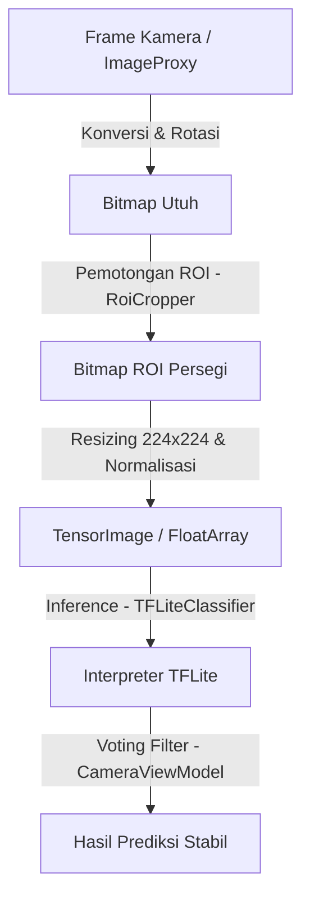

# Implementasi Area Pindai (ROI) dan Preprocessing Citra pada CnnFreshScan

Dokumen ini berisi analisis lengkap dan penjelasan teknis mengenai implementasi area pindai (*Region of Interest* atau ROI) serta tahap *preprocessing* citra pada aplikasi **CnnFreshScan**. Dokumentasi ini disusun secara terstruktur untuk membantu penulisan bab implementasi/metodologi pada skripsi, lengkap dengan potongan kode Kotlin yang relevan dan penjelasan konsep matematisnya.

---

## Alur Utama Pengolahan Citra

Sebelum masuk ke detail teknis, berikut adalah diagram alur pengolahan citra dari frame kamera hingga menghasilkan prediksi:



---

## 1. Implementasi Area Pindai (Region of Interest - ROI)

### 1.1 Konsep Geometri ROI
Area pindai digunakan untuk membatasi wilayah piksel citra yang akan diumpankan ke model saraf tiruan. Tujuannya adalah memfokuskan objek utama (buah atau sayuran) di tengah frame kamera, mengurangi pengaruh latar belakang (*background noise*), dan menghemat daya komputasi.

Agar area pindai tetap berbentuk **persegi sempurna** di berbagai ukuran layar dan orientasi perangkat (portrait atau landscape), aplikasi menghitung dimensi area pindai berdasarkan **sisi terpendek** dari dimensi citra input.

Perhitungan geometri ini diatur oleh dua parameter utama yang berada di dalam [RoiConfiguration.kt](file:///c:/Users/Muhamad%20Muslih/AndroidStudioProjects/CnnFreshScan/core/src/main/java/com/skripsi/core/domain/model/RoiConfiguration.kt):
1. **`sizeFraction` (Default: `0.8f` / 80%):** Persentase ukuran sisi persegi ROI terhadap sisi terpendek citra.
2. **`verticalBias` (Default: `-0.14f`):** Nilai pergeseran vertikal area pindai dari titik tengah layar (nilai negatif menggeser ke atas untuk mengimbangi UI card hasil prediksi di bagian bawah).

### 1.2 Penghitungan Koordinat ROI (`RoiGeometry.kt`)
Penghitungan titik koordinat pemotongan citra didefinisikan secara matematis dan diimplementasikan pada file [RoiGeometry.kt](file:///c:/Users/Muhamad%20Muslih/AndroidStudioProjects/CnnFreshScan/core/src/main/java/com/skripsi/core/data/image/RoiGeometry.kt).

#### **Formula Matematis:**
Misalkan citra input memiliki lebar $W$ (*width*) dan tinggi $H$ (*height*).
1. **Sisi Terpendek ($S$):**
   $$S = \min(W, H)$$
2. **Ukuran Sisi Area Pindai ($C$):**
   $$C = S \times \text{sizeFraction}$$
3. **Titik Kiri Awal ($X$):**
   $$X = \text{round}\left(\frac{W - C}{2}\right)$$
4. **Pergeseran Vertikal Maksimum ($\text{maxShift}$):**
   $$\text{maxShift} = \frac{H - C}{2}$$
5. **Titik Atas Awal ($Y$) dengan Vertical Bias ($B_v$):**
   $$Y = \text{round}\left(\frac{H - C}{2} + B_v \times \text{maxShift}\right)$$

*Semua hasil koordinat kemudian dibatasi (coerced) ke dalam rentang dimensi citra agar tidak terjadi error `OutOfBounds`.*

#### **Implementasi Kode Kotlin:**
Berikut adalah implementasi lengkap pada [RoiGeometry.kt](file:///c:/Users/Muhamad%20Muslih/AndroidStudioProjects/CnnFreshScan/core/src/main/java/com/skripsi/core/data/image/RoiGeometry.kt):

```kotlin
package com.skripsi.core.data.image

import kotlin.math.min
import kotlin.math.roundToInt

data class RoiBounds(
    val left: Int,
    val top: Int,
    val size: Int
) {
    val right: Int get() = left + size
    val bottom: Int get() = top + size
}

object RoiGeometry {
    const val CENTER_ROI_FRACTION = 0.8f
    const val CAMERA_ROI_VERTICAL_BIAS = -0.14f

    fun calculateImageBounds(
        imageWidth: Int,
        imageHeight: Int,
        sizeFraction: Float = CENTER_ROI_FRACTION,
        verticalBias: Float = CAMERA_ROI_VERTICAL_BIAS
    ): RoiBounds {
        val safeWidth = imageWidth.coerceAtLeast(1)
        val safeHeight = imageHeight.coerceAtLeast(1)
        val normalizedFraction = sizeFraction.coerceIn(0.1f, 1f)
        
        // 1. Tentukan ukuran sisi persegi berdasarkan sisi terpendek citra
        val cropSize = (min(safeWidth, safeHeight) * normalizedFraction)
            .roundToInt()
            .coerceIn(1, min(safeWidth, safeHeight))

        // 2. Hitung posisi X (horizontal) agar tepat berada di tengah
        val left = ((safeWidth - cropSize) / 2f)
            .roundToInt()
            .coerceIn(0, safeWidth - cropSize)
            
        // 3. Hitung posisi Y (vertikal) dengan memperhitungkan vertical bias
        val centeredTop = ((safeHeight - cropSize) / 2f)
            .roundToInt()
            .coerceIn(0, safeHeight - cropSize)
        val maxShift = ((safeHeight - cropSize).coerceAtLeast(0)) / 2f
        val top = (centeredTop + verticalBias.coerceIn(-0.45f, 0.45f) * maxShift)
            .roundToInt()
            .coerceIn(0, safeHeight - cropSize)

        return RoiBounds(left = left, top = top, size = cropSize)
    }
}
```

### 1.3 Ekstraksi/Pemotongan Citra (`RoiCropper.kt`)
Setelah batas koordinat (`RoiBounds`) diperoleh, aplikasi melakukan pemotongan citra asli menggunakan class [RoiCropper.kt](file:///c:/Users/Muhamad%20Muslih/AndroidStudioProjects/CnnFreshScan/core/src/main/java/com/skripsi/core/data/image/RoiCropper.kt). 

Pemotongan dilakukan secara efisien menggunakan fungsi native `Bitmap.createBitmap` milik Android SDK:

```kotlin
package com.skripsi.core.data.image

import android.graphics.Bitmap
import javax.inject.Inject
import com.skripsi.core.data.image.RoiGeometry.CAMERA_ROI_VERTICAL_BIAS
import com.skripsi.core.data.image.RoiGeometry.CENTER_ROI_FRACTION

class RoiCropper @Inject constructor() {
    fun cropCenterSquare(
        bitmap: Bitmap,
        sizeFraction: Float = CENTER_ROI_FRACTION,
        verticalBias: Float = CAMERA_ROI_VERTICAL_BIAS
    ): Bitmap {
        // Mendapatkan koordinat area pindai dari utility geometri
        val bounds = RoiGeometry.calculateImageBounds(
            imageWidth = bitmap.width,
            imageHeight = bitmap.height,
            sizeFraction = sizeFraction,
            verticalBias = verticalBias
        )

        // Melakukan pemotongan (cropping) bitmap
        return Bitmap.createBitmap(bitmap, bounds.left, bounds.top, bounds.size, bounds.size)
    }

    companion object {
        const val CENTER_ROI_FRACTION = RoiGeometry.CENTER_ROI_FRACTION
        const val CAMERA_ROI_VERTICAL_BIAS = RoiGeometry.CAMERA_ROI_VERTICAL_BIAS
    }
}
```

### 1.4 Visualisasi Area Pindai pada Layar (Presentation Layer)
Agar pengguna mengetahui letak area yang akan dipotong, UI Jetpack Compose menggambar bingkai pembatas di atas tampilan kamera (*PreviewView*).

Aplikasi mendefinisikan helper [CameraRoi.kt](file:///c:/Users/Muhamad%20Muslih/AndroidStudioProjects/CnnFreshScan/app/src/main/java/com/skripsi/cnnfreshscan/presentation/util/CameraRoi.kt) untuk menghitung dan menskalakan koordinat ROI dari ukuran citra analisis ke ukuran tampilan layar (*view*).

Fungsi `stableCenteredRoiRect` menghitung objek `Rect` pembatas untuk digambar di UI:

```kotlin
fun stableCenteredRoiRect(
    viewWidth: Float,
    viewHeight: Float,
    sizeFraction: Float,
    verticalBias: Float
): Rect {
    val safeWidth = viewWidth.coerceAtLeast(0f)
    val safeHeight = viewHeight.coerceAtLeast(0f)
    val side = min(safeWidth, safeHeight) * sizeFraction.coerceIn(0.1f, 1f)
    val left = (safeWidth - side) / 2f
    val centeredTop = ((safeHeight - side) / 2f).roundToInt().toFloat()
    val maxShift = (safeHeight - side).coerceAtLeast(0f) / 2f
    val top = (centeredTop + verticalBias.coerceIn(-0.45f, 0.45f) * maxShift)
        .coerceIn(0f, safeHeight - side)

    return Rect(left, top, left + side, top + side)
}
```

Di dalam [CameraScreen.kt](file:///c:/Users/Muhamad%20Muslih/AndroidStudioProjects/CnnFreshScan/app/src/main/java/com/skripsi/cnnfreshscan/presentation/screen/CameraScreen.kt), komponen `ScannerOverlay` menggunakan custom canvas dengan operasi `BlendMode.Clear` untuk melubangi area ROI di tengah overlay gelap sehingga area luar ROI terlihat buram/gelap sedangkan area dalam ROI bersih tanpa halangan:

```kotlin
drawRect(color = CameraOverlayTint.copy(alpha = 0.48f))
drawRoundRect(
    color = Color.Transparent,
    topLeft = Offset(left, top),
    size = Size(boxSide, boxSide),
    cornerRadius = CornerRadius(cornerRadius, cornerRadius),
    blendMode = BlendMode.Clear
)
```

---

## 2. Preprocessing Citra

Setelah citra dipotong berdasarkan area pindai (ROI), citra tersebut belum bisa langsung digunakan sebagai masukan model MobileNetV2. Model deep learning membutuhkan input berupa matriks/tensor dengan dimensi yang tetap dan rentang nilai piksel tertentu.

Tahap *preprocessing* pada aplikasi CnnFreshScan meliputi:
1. **Resizing (Penyelarasan Dimensi):** Mengubah ukuran gambar ROI persegi menjadi $224 \times 224$ piksel.
2. **Normalisasi Nilai Piksel:** Mengubah nilai piksel RGB dari rentang $[0, 255]$ menjadi rentang float $[-1.0, 1.0]$.

### 2.1 Implementasi Preprocessing (`ImagePreprocessor.kt`)
Tahap ini diimplementasikan pada file [ImagePreprocessor.kt](file:///c:/Users/Muhamad%20Muslih/AndroidStudioProjects/CnnFreshScan/core/src/main/java/com/skripsi/core/data/image/ImagePreprocessor.kt). Terdapat dua pendekatan yang disediakan di dalam file ini:

#### **Metode 1: Menggunakan TensorFlow Lite Support Library (Rekomendasi / Jalur Utama)**
Metode ini menggunakan `ImageProcessor` bawaan TFLite Support Library yang berjalan sangat cepat karena menggunakan optimasi memori tingkat rendah.

```kotlin
private val processor = ImageProcessor.Builder()
    // 1. Resizing citra ke 224x224 dengan interpolasi Bilinear
    .add(ResizeOp(INPUT_HEIGHT, INPUT_WIDTH, ResizeOp.ResizeMethod.BILINEAR))
    // 2. Normalisasi nilai piksel ke rentang [-1.0f, 1.0f]
    .add(NormalizeOp(127.5f, 127.5f))
    .build()

fun preprocess(bitmap: Bitmap): TensorImage {
    val tensorImage = TensorImage(DataType.FLOAT32)
    tensorImage.load(bitmap)
    return processor.process(tensorImage)
}
```

*Penjelasan Parameter Normalisasi:*
`NormalizeOp(127.5f, 127.5f)` menerapkan operasi berikut pada setiap piksel $x$:
$$x_{\text{norm}} = \frac{x - 127.5}{127.5}$$
*   Jika nilai piksel asli $x = 0$ (hitam), maka $x_{\text{norm}} = \frac{0 - 127.5}{127.5} = -1.0$.
*   Jika nilai piksel asli $x = 127.5$ (abu-abu tengah), maka $x_{\text{norm}} = \frac{127.5 - 127.5}{127.5} = 0.0$.
*   Jika nilai piksel asli $x = 255$ (putih), maka $x_{\text{norm}} = \frac{255 - 127.5}{127.5} = 1.0$.

#### **Metode 2: Pemrosesan Manual ke `FloatArray` (Untuk custom pipeline / Debug)**
Metode ini melakukan ekstraksi piksel satu per satu secara manual menggunakan operasi bitwise dan konversi manual ke array 1 dimensi bertipe data float.

```kotlin
fun preprocessToFloatArray(bitmap: Bitmap): FloatArray {
    // 1. Resize bitmap menggunakan ekstensi Kotlin graphics
    val scaledBitmap = bitmap.scale(INPUT_WIDTH, INPUT_HEIGHT)
    val pixels = IntArray(INPUT_WIDTH * INPUT_HEIGHT)
    scaledBitmap.getPixels(pixels, 0, INPUT_WIDTH, 0, 0, INPUT_WIDTH, INPUT_HEIGHT)

    // Ukuran array = 224 * 224 * 3 (RGB Channels)
    val output = FloatArray(INPUT_WIDTH * INPUT_HEIGHT * RGB_CHANNELS)
    var outputIndex = 0
    
    // 2. Iterasi setiap piksel warna ARGB
    pixels.forEach { pixel ->
        // Ekstraksi komponen Red, Green, Blue (mengabaikan Alpha)
        val red = (pixel shr 16) and 0xFF
        val green = (pixel shr 8) and 0xFF
        val blue = pixel and 0xFF
        
        // Normalisasi masing-masing warna dan masukkan ke array output
        output[outputIndex++] = normalizeMobileNetV2(red)
        output[outputIndex++] = normalizeMobileNetV2(green)
        output[outputIndex++] = normalizeMobileNetV2(blue)
    }
    return output
}

private fun normalizeMobileNetV2(value: Int): Float = (value - 127.5f) / 127.5f
```

*Operasi Bitwise:*
*   `(pixel shr 16) and 0xFF` menggeser bit piksel sebanyak 16 bit ke kanan lalu melakukan operasi AND dengan `0xFF` untuk mendapatkan nilai intensitas warna merah (Red).
*   `(pixel shr 8) and 0xFF` menggeser bit piksel sebanyak 8 bit ke kanan lalu melakukan operasi AND dengan `0xFF` untuk mendapatkan warna hijau (Green).
*   `pixel and 0xFF` mengambil 8 bit terakhir untuk mendapatkan warna biru (Blue).

---

## 3. Integrasi Alur Data pada Repository (`ProduceRepositoryImpl.kt`)

Semua komponen di atas dihubungkan pada tingkat repositori di file [ProduceRepositoryImpl.kt](file:///c:/Users/Muhamad%20Muslih/AndroidStudioProjects/CnnFreshScan/core/src/main/java/com/skripsi/core/data/repository/ProduceRepositoryImpl.kt). Repositori ini menerima input raw `Bitmap` dari kamera, mengoordinasikan pemotongan ROI, melakukan preprocessing citra, dan mengirimkannya ke interpreter TensorFlow Lite.

```kotlin
override suspend fun analyzeImage(bitmap: Bitmap): List<ProduceClassificationResult> {
    return withContext(Dispatchers.IO) {
        // 1. Pastikan model TFLite telah diinisialisasi
        if (!classifierReady) {
            initializationLock.withLock {
                if (!classifierReady) {
                    val initialized = tfliteClassifier.initialize()
                    if (!initialized) {
                        throw RuntimeException("Failed to initialize TFLite classifier")
                    }
                    classifierReady = true
                }
            }
        }

        // 2. Pemotongan ROI persegi
        val roiBitmap = roiCropper.cropCenterSquare(bitmap)

        // 3. Preprocessing citra (Resize & Normalisasi)
        val preprocessedTensorImage = imagePreprocessor.preprocess(roiBitmap)

        // 4. Proses Klasifikasi dengan TFLite Interpreter
        val tfliteResults = tfliteClassifier.classifyFromTensor(preprocessedTensorImage)

        // 5. Pemetaan hasil TFLite ke domain model
        tfliteResults.map { result ->
            ProduceClassificationResult(
                name = result.label,
                accuracyScore = result.confidence
            )
        }
    }
}
```

---

## Kesimpulan Analisis untuk Skripsi

1. **Efisiensi Komputasi:** Pemotongan ROI persegi dilakukan **sebelum** proses resizing ke $224 \times 224$. Hal ini menghemat operasi scaling memori karena piksel di luar area pindai langsung diabaikan.
2. **Konsistensi Area:** Pemetaan ROI di UI (Compose Canvas) menggunakan formula matematika yang sama dengan pemotongan citra di Data Layer (`RoiGeometry`). Ini menjamin buah/sayur yang berada di dalam bingkai pada layar adalah bagian yang benar-benar dipotong dan dianalisis oleh kecerdasan buatan.
3. **Penyelarasan Model (Normalization Match):** Proses preprocessing citra menggunakan normalisasi dengan nilai tengah 127.5, yang membagi citra ke rentang $[-1.0, 1.0]$. Normalisasi ini sangat penting dan wajib sama persis dengan preprocessing citra yang digunakan pada saat model MobileNetV2 dilatih (*training*), agar tingkat akurasi prediksi model di perangkat Android optimal.
