<p align="center">
  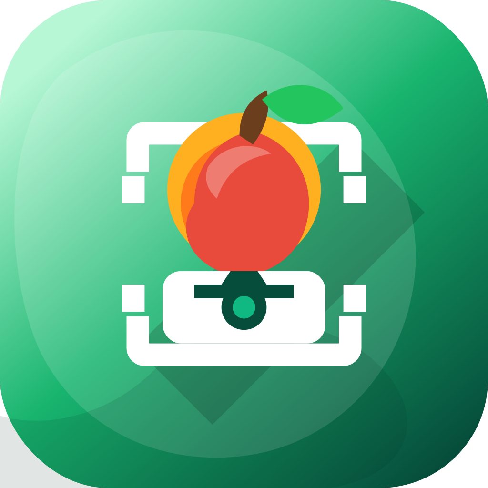
</p>

<h1 align="center">Lampiran Kode — Skripsi</h1>

<p align="center">
  <strong>Klasifikasi Kesegaran Buah dan Sayur Berbasis CNN (MobileNetV2) pada Platform Android</strong>
</p>

<p align="center">
  
  
  
  
  
</p>

---

## 🎓 Informasi Skripsi

| Atribut | Detail |
|---|---|
| **Judul** | Klasifikasi Kesegaran Buah dan Sayur Berbasis CNN (MobileNetV2) pada Platform Android |
| **Penulis** | Muhamad Muslih |
| **NIM** | 3337220025 |
| **Program Studi** | Informatika |
| **Institusi** | Universitas Sultan Ageng Tirtayasa |
| **Pembimbing I** | Royan Habibie Sukarna, S.Kom., M.Kom. |
| **Pembimbing II** | Czidni Sika Azkia, M.Kom. |

---

## 📋 Daftar Isi

- [Tentang Proyek](#-tentang-proyek)
- [Struktur Repository](#-struktur-repository)
- [CnnFreshScan — Aplikasi Android](#-cnnfreshscan--aplikasi-android)
- [Modeling — Training Model CNN](#-modeling--training-model-cnn)
- [Visualisasi Pengujian](#-visualisasi-pengujian)
- [Dokumentasi Pemotretan Dataset](#-dokumentasi-pemotretan-dataset)
- [Dokumentasi Pengujian Aplikasi](#-dokumentasi-pengujian-aplikasi)
- [Hasil Klasifikasi Aplikasi](#-hasil-klasifikasi-aplikasi)

---

## 📖 Tentang Proyek

Repository ini merupakan **lampiran kode** dari penelitian skripsi yang bertujuan membangun sistem klasifikasi kesegaran buah dan sayur berbasis **Deep Learning** yang berjalan langsung di perangkat Android (*on-device inference*).

Sistem ini terdiri dari dua komponen utama:

1. **Pipeline Training Model** — Notebook Python untuk mempersiapkan dataset dan melatih model MobileNetV2 menggunakan K-Fold Cross Validation.
2. **Aplikasi Android (CnnFreshScan)** — Aplikasi Android yang mengintegrasikan model TFLite untuk klasifikasi real-time via kamera.

### Komoditas yang Diklasifikasikan

Aplikasi mampu mengklasifikasikan **6 jenis buah dan sayur** ke dalam **2 kondisi** (Segar / Busuk), menghasilkan total **12 kelas**:

| 🍌 Pisang | 🥭 Mangga | 🍊 Jeruk | 🥕 Wortel | 🥒 Timun | 🍅 Tomat |
|:---:|:---:|:---:|:---:|:---:|:---:|
| Segar / Busuk | Segar / Busuk | Segar / Busuk | Segar / Busuk | Segar / Busuk | Segar / Busuk |

---

## 📂 Struktur Repository

```
lampiran kode/
│
├── CnnFreshScan/                          # Aplikasi Android (Kotlin + Jetpack Compose)
│   ├── app/                               # Modul Presentation Layer (UI & ViewModel)
│   ├── core/                              # Modul Domain & Data Layer (Use Case, Repository)
│   ├── tflite_engine/                     # Modul ML (TFLite + model .tflite)
│   ├── docs/                              # Dokumentasi arsitektur & konfigurasi ROI
│   └── README.md                          # Dokumentasi teknis lengkap aplikasi Android
│
├── modeling/                              # Pipeline training model CNN
│   ├── dataset/                           # Dataset asli (buah & sayur segar/busuk)
│   ├── notebooks/                         # Jupyter Notebook training & preprocessing
│   ├── outputs/                           # Output: data bersih, augmentasi, model
│   └── README.md                          # Dokumentasi pipeline modeling
│
├── visualisasi_pengujian_inferensi_dan_jarak/  # Analisis waktu inferensi & pengaruh jarak
│   ├── dataset/                           # Data pengujian per perangkat & jarak
│   └── visualisasi_dataset_perangkat_jarak.ipynb
│
├── visualisasi_pengujian_ram/             # Analisis performa RAM & response time
│   ├── dataset/                           # Log benchmark Redmi 9A & Note 10 Pro
│   ├── output/                            # Grafik & tabel hasil visualisasi
│   └── visualisasi_performa_skripsi.ipynb
│
└── dokumentasi/                           # Foto dokumentasi pemotretan & pengujian
```

---

## 📱 CnnFreshScan — Aplikasi Android

**CnnFreshScan** adalah aplikasi Android yang mengklasifikasikan tingkat kesegaran buah dan sayur secara *real-time* menggunakan kamera perangkat.

### Fitur Utama

| Fitur | Deskripsi |
|---|---|
| 🔍 **Klasifikasi Real-Time** | Analisis frame kamera langsung dengan prediksi live dan confidence score |
| 🎯 **Region of Interest (ROI)** | Area pindai terkalibrasi untuk crop gambar sebelum inferensi |
| 🗳️ **Majority Voting** | Stabilisasi prediksi dari sliding window 20 frame terakhir |
| 📊 **Hasil Detail** | Label, confidence, waktu inferensi, dan saran penanganan |
| 💾 **Simpan ke Galeri** | Menyimpan hasil klasifikasi dengan watermark label & confidence |
| ⚡ **On-Device Inference** | Tidak memerlukan koneksi internet |

### Tech Stack

| Layer | Teknologi |
|---|---|
| **Bahasa** | Kotlin 2.0.21 |
| **UI** | Jetpack Compose + Material Design 3 |
| **Kamera** | CameraX 1.6.1 |
| **ML Runtime** | TensorFlow Lite via Google Play Services 16.5.0 |
| **Arsitektur** | Clean Architecture + MVVM + Use Case |
| **DI** | Dagger Hilt 2.59.2 |
| **Min SDK** | Android 10 (API 29) |

### Spesifikasi Model

| Parameter | Nilai |
|---|---|
| **Arsitektur** | MobileNetV2 |
| **Format** | TensorFlow Lite (INT8 Quantized) |
| **Ukuran File** | 2.60 MB |
| **Input** | `[1, 224, 224, 3]` |
| **Output** | `[1, 12]` — probabilitas 12 kelas |

> 📖 Untuk dokumentasi teknis lengkap (arsitektur, instalasi, cara build), lihat [`CnnFreshScan/README.md`](CnnFreshScan/README.md)

---

## 🧠 Modeling — Training Model CNN

Pipeline training model menggunakan metodologi **CRISP-DM** dengan dua tahap:

| Notebook | Lingkungan | Fungsi |
|---|---|---|
| [`01_local_processing.ipynb`](modeling/notebooks/01_local_processing.ipynb) | Lokal (Python) | Scan data, cleaning, padding, augmentasi & penyeimbangan kelas |
| [`02_colab_training_and_deployment.ipynb`](modeling/notebooks/02_colab_training_and_deployment.ipynb) | Google Colab (GPU) | Training K-Fold, evaluasi, konversi ke TFLite INT8 |

### Konfigurasi Training

- **Arsitektur**: MobileNetV2 (pretrained ImageNet, fine-tuned)
- **Validasi**: K-Fold Cross Validation
- **Kuantisasi**: INT8 Post-Training Quantization
- **Input Preprocessing**: Padding → Resize 224×224 → Normalisasi `[-1, 1]`

> 📖 Untuk panduan lengkap menjalankan notebook, lihat [`modeling/README.md`](modeling/README.md)

---

## 📊 Visualisasi Pengujian

### Pengujian Performa RAM & Response Time

Pengujian dilakukan pada **2 perangkat** dengan **3 sesi pengujian (runs)** masing-masing:

| No | Perangkat | Android | Chipset | RAM | Startup | Inferensi (Live) | Idle RAM | Peak RAM |
|:---:|---|---|---|:---:|:---:|:---:|:---:|:---:|
| 1 | Redmi Note 10 Pro | Android 12 (API 31) | Snapdragon 732G | 6 GB | 3.53 s | 69.10 ms | 202.93 MB | 215.86 MB |
| 2 | Redmi 9A | Android 10 (API 29) | Helio G25 | 4 GB | 12.15 s | 73.33 ms | 146.28 MB | 146.28 MB |

> 📓 Notebook: [`visualisasi_pengujian_ram/visualisasi_performa_skripsi.ipynb`](visualisasi_pengujian_ram/visualisasi_performa_skripsi.ipynb)

### Pengujian Waktu Inferensi & Pengaruh Jarak

Pengujian akurasi klasifikasi pada berbagai kondisi jarak pengambilan gambar (tanpa jarak, 10 cm, 20 cm, 30 cm) pada kedua perangkat uji.

> 📓 Notebook: [`visualisasi_pengujian_inferensi_dan_jarak/visualisasi_dataset_perangkat_jarak.ipynb`](visualisasi_pengujian_inferensi_dan_jarak/visualisasi_dataset_perangkat_jarak.ipynb)

---

## 📸 Dokumentasi Pemotretan Dataset

Berikut adalah dokumentasi proses pemotretan dataset asli yang dilakukan secara langsung untuk memperoleh gambar buah dan sayur segar maupun busuk.

### Lokasi Pengambilan Sampel

Dataset buah dan sayur diperoleh dari pasar tradisional dan sumber lokal sekitar lokasi penelitian.

<p align="center">
  
  <br>
  <em>Lokasi pengambilan sampel buah dan sayur di pasar tradisional</em>
</p>

### Proses Pemotretan Dataset

Dataset dikumpulkan dengan cara memotret langsung buah dan sayur dalam berbagai kondisi (segar dan busuk) menggunakan kamera smartphone yang dipasang pada tripod untuk kestabilan pengambilan gambar.

<p align="center">
  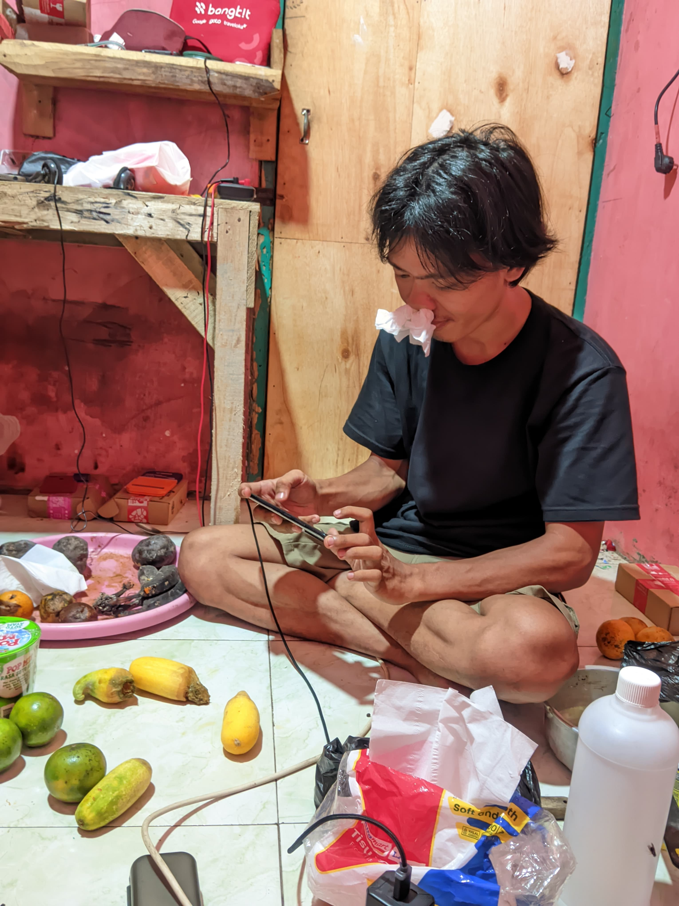
  <br>
  <em>Proses pemotretan dataset buah (busuk & segar) dengan berbagai variasi kondisi</em>
</p>

---

## 🧪 Dokumentasi Pengujian Aplikasi

Pengujian aplikasi **CnnFreshScan** dilakukan secara langsung (*real-world testing*) dengan mengarahkan kamera ke berbagai sampel buah dan sayur.

### Setup Pengujian

Pengujian menggunakan tripod sebagai penyangga perangkat agar posisi kamera stabil, sehingga kondisi pengujian konsisten di setiap sesi.

<table align="center">
  <tr>
    <td align="center">
      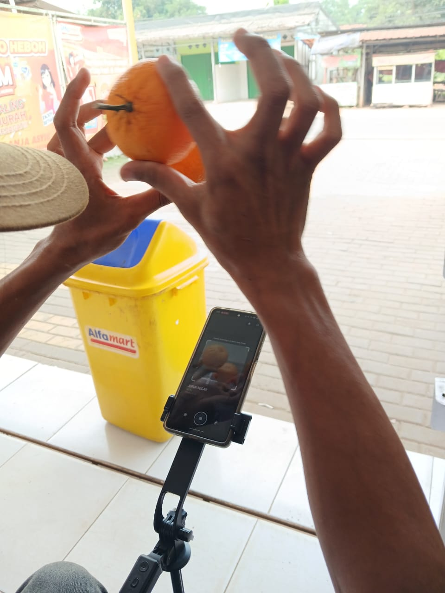<br>
      <em>Pengujian — tampilan kamera mendeteksi jeruk segar</em>
    </td>
    <td align="center">
      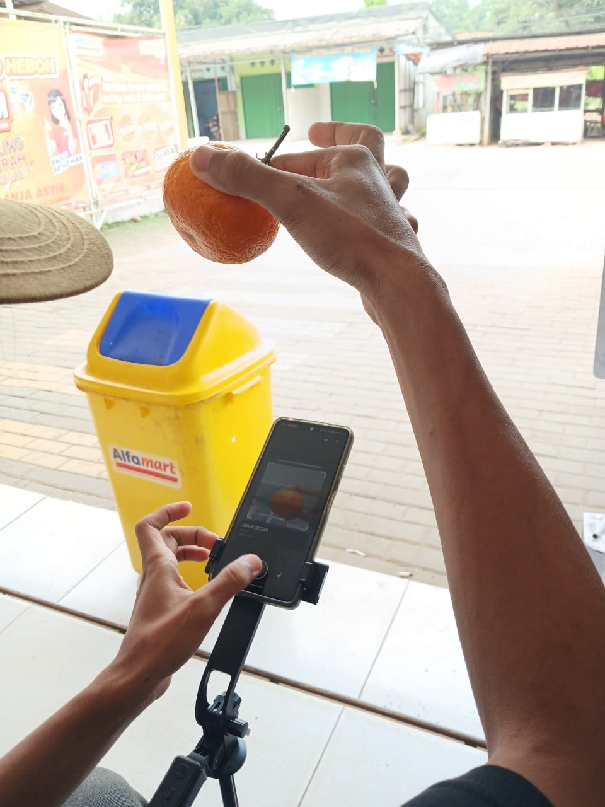<br>
      <em>Pengujian — tampak samping, kamera aktif mendeteksi jeruk</em>
    </td>
  </tr>
  <tr>
    <td align="center">
      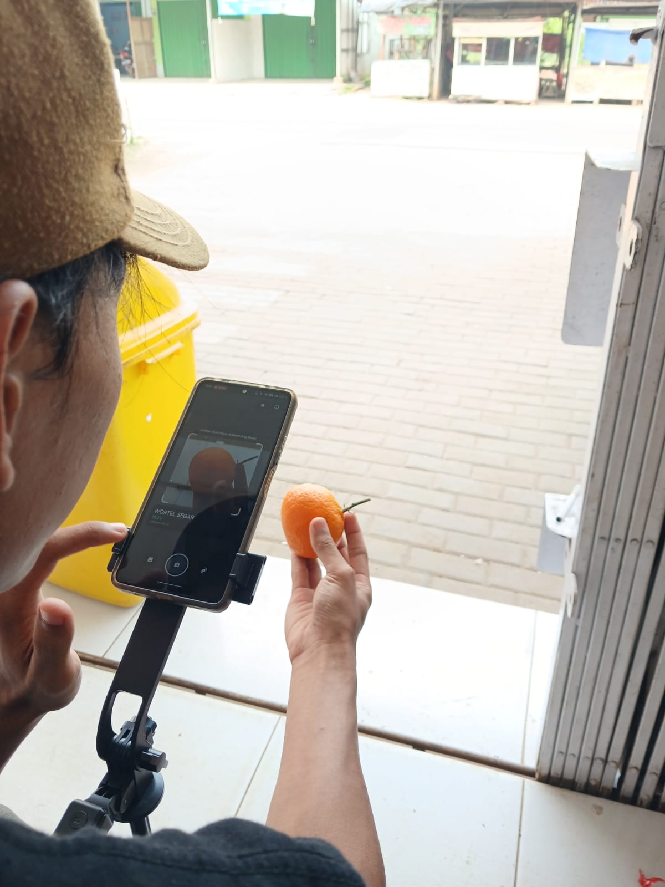<br>
      <em>Peneliti mengecek hasil prediksi pada layar (WORTEL SEGAR)</em>
    </td>
    <td align="center">
      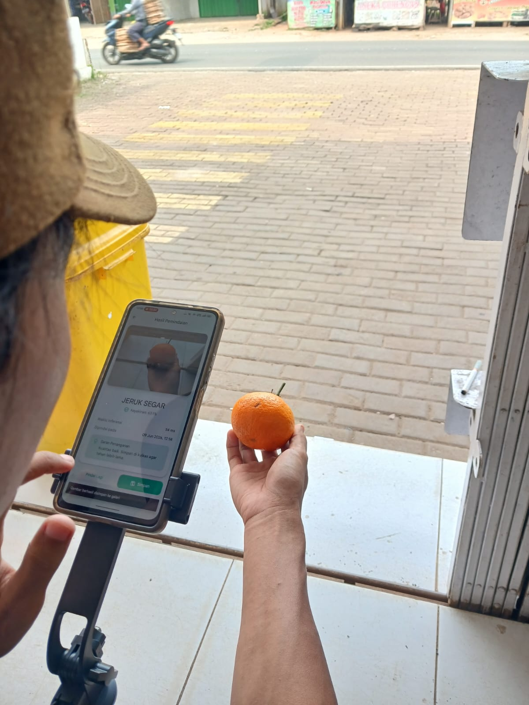<br>
      <em>Tampilan halaman hasil — JERUK SEGAR dengan detail confidence</em>
    </td>
  </tr>
</table>

<p align="center">
  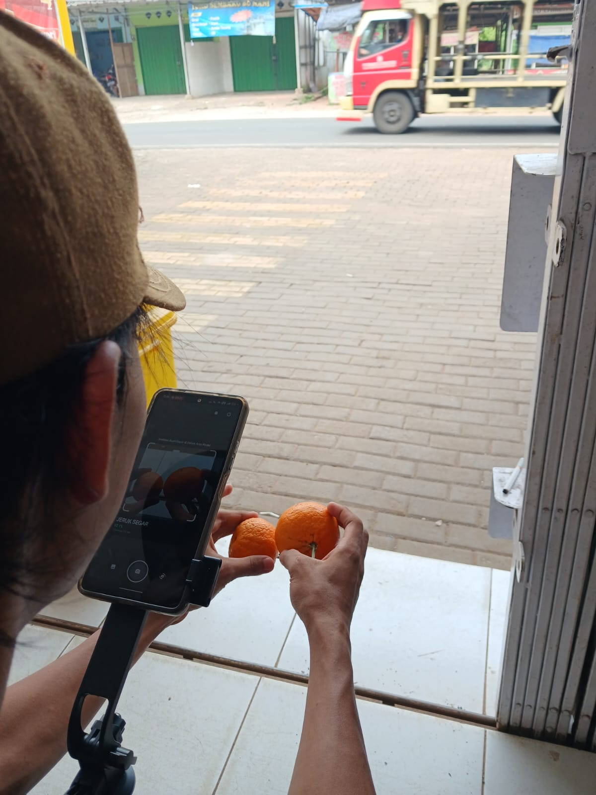
  <br>
  <em>Pengujian dengan dua buah jeruk — prediksi JERUK SEGAR ditampilkan secara real-time</em>
</p>

---

## 🖼️ Hasil Klasifikasi Aplikasi

Berikut adalah contoh foto hasil klasifikasi yang disimpan otomatis oleh aplikasi ke galeri perangkat. Setiap foto dilengkapi **watermark label dan confidence score**.

<table align="center">
  <tr>
    <td align="center">
      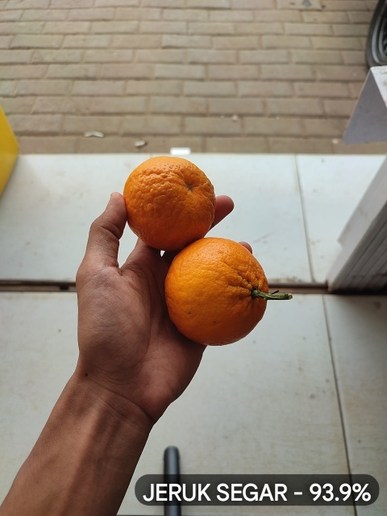<br>
      <em>JERUK SEGAR — 93.9%</em>
    </td>
    <td align="center">
      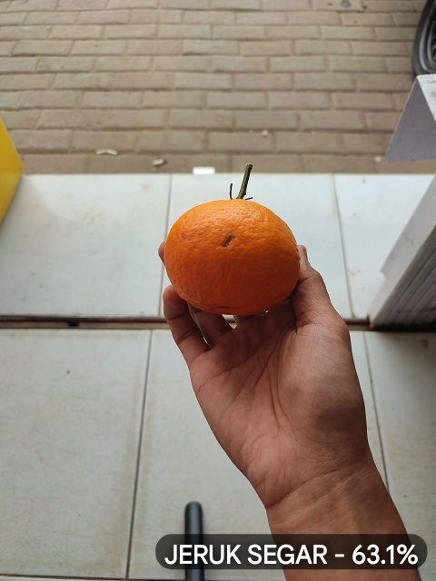<br>
      <em>JERUK SEGAR — 63.1%</em>
    </td>
    <td align="center">
      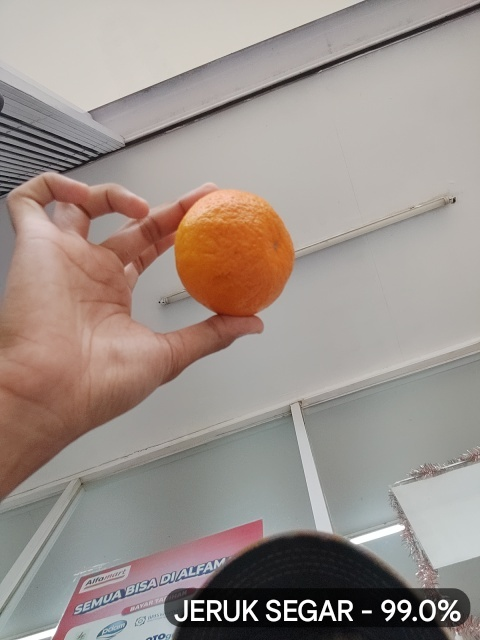<br>
      <em>JERUK SEGAR — 99.0%</em>
    </td>
    <td align="center">
      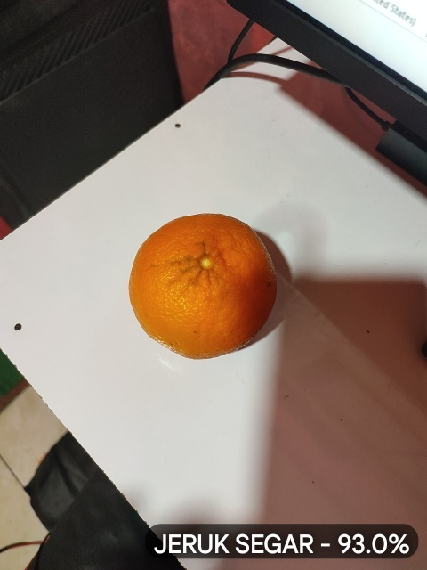<br>
      <em>JERUK SEGAR — 93.0%</em>
    </td>
  </tr>
</table>

> **Catatan**: Foto hasil klasifikasi disimpan ke galeri perangkat secara otomatis oleh fitur *simpan ke galeri* dengan watermark yang menampilkan label dan confidence score hasil prediksi model.

---

<p align="center">
  <sub>Dibuat dengan ❤️ oleh <strong>Muhamad Muslih</strong> — Program Studi Informatika, Universitas Sultan Ageng Tirtayasa</sub>
</p>
