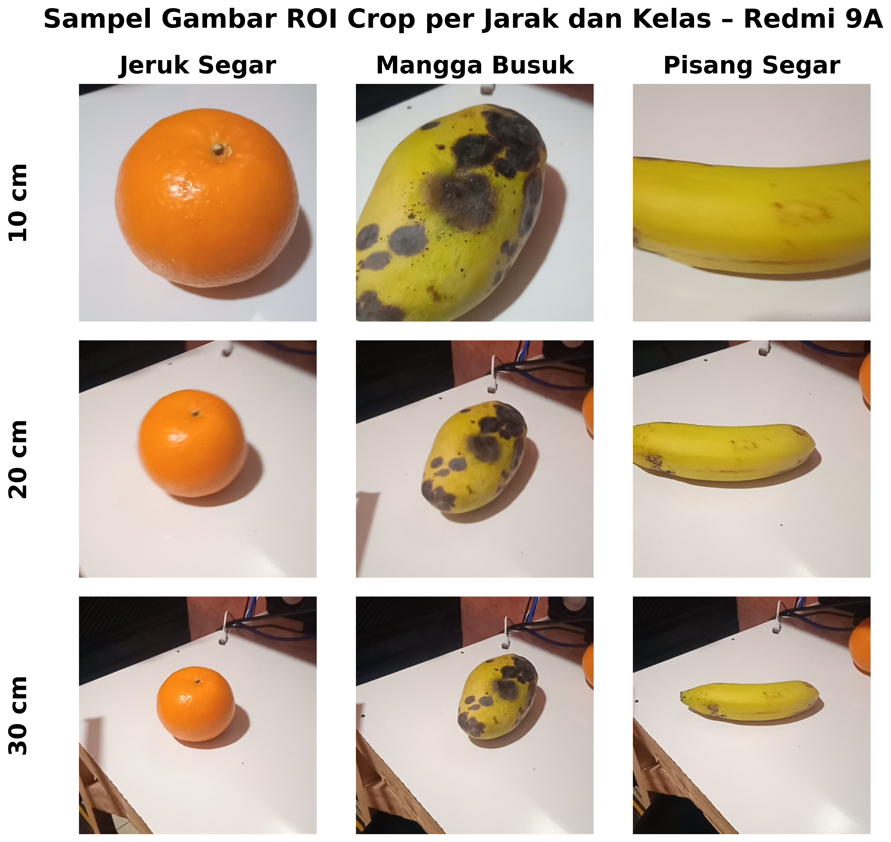
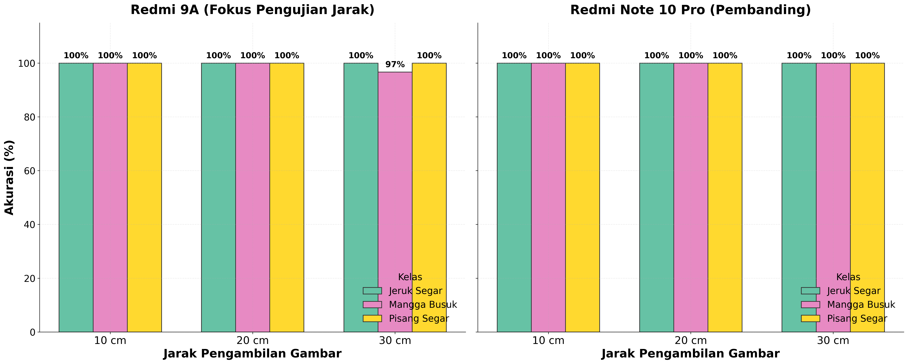
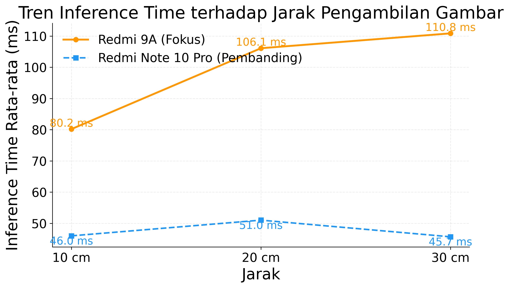

# Visualisasi Pengujian Inferensi dan Jarak

Modul ini berisi **data pengujian, notebook analisis, dan output visualisasi** untuk dua skenario pengujian utama pada aplikasi **CnnFreshScan**:

1. **Pengujian Klasifikasi per Kelas** — akurasi dan waktu inferensi pada 12 kelas di dua perangkat
2. **Pengujian Pengaruh Jarak** — bagaimana akurasi dan waktu inferensi berubah seiring jarak kamera ke objek (10 cm, 20 cm, 30 cm)

---

## 📋 Daftar Isi

- [Tujuan Pengujian](#-tujuan-pengujian)
- [Perangkat Uji](#-perangkat-uji)
- [Metodologi Pengujian](#-metodologi-pengujian)
- [Struktur Folder](#-struktur-folder)
- [Hasil Pengujian Klasifikasi per Kelas](#-hasil-pengujian-klasifikasi-per-kelas)
- [Hasil Pengujian Pengaruh Jarak](#-hasil-pengujian-pengaruh-jarak)
- [Cara Menjalankan Notebook](#-cara-menjalankan-notebook)

---

## 🎯 Tujuan Pengujian

Pengujian ini bertujuan untuk:

- Mengukur **akurasi klasifikasi** model MobileNetV2 (INT8) pada setiap kelas buah dan sayur di kondisi nyata (*real-world*)
- Mengukur **waktu inferensi** (*inference time*) pada dua perangkat dengan spesifikasi hardware berbeda
- Menganalisis **pengaruh jarak pengambilan gambar** terhadap akurasi dan waktu inferensi model

---

## 📱 Perangkat Uji

| Atribut | Redmi Note 10 Pro *(Pembanding)* | Redmi 9A *(Fokus Pengujian Jarak)* |
|---|---|---|
| **Android** | Android 12 (API 31) | Android 10 (API 29) |
| **Chipset** | Snapdragon 732G | Helio G25 |
| **RAM** | 6 GB | 4 GB |
| **Kamera** | 108 MP | 13 MP |
| **Peran** | Perangkat high-end sebagai pembanding | Perangkat entry-level sebagai fokus pengujian |

> Redmi 9A dipilih sebagai fokus pengujian jarak karena merepresentasikan perangkat dengan spesifikasi **minimum** yang ditargetkan aplikasi (Android 10, chipset entry-level).

---

## 🔬 Metodologi Pengujian

### Pengujian Klasifikasi per Kelas

- **Total capture**: 1.200 gambar per perangkat (100 gambar × 12 kelas)
- **Kondisi**: Tanpa variasi jarak — kamera diposisikan pada jarak optimal
- **Metrik yang diukur**:
  - Akurasi per kelas (%)
  - Rata-rata inference time (ms)
  - Median inference time (ms)
  - P95 inference time (ms) — waktu inferensi pada persentil ke-95

### Pengujian Pengaruh Jarak

- **Variasi jarak**: 10 cm, 20 cm, 30 cm dari objek ke kamera
- **Kelas yang diuji**: Jeruk Segar, Mangga Busuk, Pisang Segar (3 kelas representatif)
- **Total capture per jarak**: 100 gambar per kelas per jarak
- **Metode**: Kamera di-mount pada tripod, objek diletakkan di atas alas putih, jarak diukur menggunakan penggaris

### Mekanisme Capture

Setiap "capture" merupakan satu frame yang:
1. Di-crop berdasarkan area **ROI (Region of Interest)** yang dikonfigurasi di aplikasi
2. Di-resize menjadi **224 × 224 piksel**
3. Di-normalisasi ke rentang `[-1, 1]`
4. Diinferensikan oleh model TFLite INT8

---

## 📂 Struktur Folder

```
visualisasi_pengujian_inferensi_dan_jarak/
│
├── dataset/                                    # Data mentah hasil pengujian (di-ignore git)
│   ├── Redmi 9A/
│   │   ├── tanpa jarak/                        # 12 kelas × ~100 gambar crop ROI
│   │   │   ├── jeruk busuk/
│   │   │   ├── jeruk segar/
│   │   │   └── ... (12 kelas total)
│   │   ├── 10 cm/
│   │   ├── 20 cm/
│   │   ├── 30 cm/
│   │   └── data crop roi/
│   └── Redmi Note 10 Pro/
│       ├── tanpa jarak/
│       ├── 10 cm/
│       ├── 20 cm/
│       └── 30 cm/
│
├── outputs/                                    # Output visualisasi (sudah ter-generate)
│   ├── pengujian_perangkat_jarak/
│   │   ├── 00_sampel_roi_crop_redmi9a.png      # Sampel crop ROI per jarak & kelas
│   │   ├── 03_perbandingan_akurasi_jarak.png   # Grafik akurasi per jarak
│   │   └── 05_tren_inference_vs_jarak.png      # Grafik tren inference time vs jarak
│   └── visualisasi_skripsi/
│       ├── 03_perbandingan_akurasi_antar_perangkat.png  # Bar chart akurasi 12 kelas
│       ├── 08_bar_rata_inference_perbandingan.png        # Bar chart inference time
│       ├── tabel_metrik_perbandingan_perangkat.csv       # Tabel ringkasan antar perangkat
│       ├── tabel_ringkasan_redmi9a.csv                   # Detail per kelas Redmi 9A
│       └── tabel_ringkasan_note10pro.csv                 # Detail per kelas Note 10 Pro
│
├── visualisasi_dataset_perangkat_jarak.ipynb   # Notebook utama: analisis jarak & klasifikasi
└── visualisasi_hasil_penelitian.ipynb          # Notebook pendukung: visualisasi untuk skripsi
```

---

## 📊 Hasil Pengujian Klasifikasi per Kelas

### Ringkasan Perbandingan Perangkat

| Perangkat | Total Capture | Benar | Salah | Akurasi | Rata-rata Inferensi | Total Pemrosesan |
|---|:---:|:---:|:---:|:---:|:---:|:---:|
| **Redmi Note 10 Pro** | 1.200 | 1.134 | 66 | **94,50%** | 37,56 ms | 55,46 ms |
| **Redmi 9A** | 1.200 | 1.132 | 68 | **94,33%** | 86,57 ms | 153,08 ms |

> Meskipun terdapat perbedaan hardware yang signifikan, akurasi keduanya hampir identik — selisih hanya **0,17%**. Hal ini membuktikan model INT8 bekerja konsisten di berbagai kelas perangkat.

### Akurasi per Kelas — Redmi Note 10 Pro

| No | Kelas | Capture | Benar | Salah | Akurasi | Rata-rata (ms) | Median (ms) | P95 (ms) |
|:---:|---|:---:|:---:|:---:|:---:|:---:|:---:|:---:|
| 1 | Jeruk Busuk | 100 | 100 | 0 | **100%** | 32,40 | 28,81 | 54,25 |
| 2 | Jeruk Segar | 100 | 100 | 0 | **100%** | 55,23 | 51,59 | 101,37 |
| 3 | Mangga Busuk | 100 | 100 | 0 | **100%** | 41,59 | 39,77 | 62,16 |
| 4 | Mangga Segar | 100 | 92 | 8 | 92% | 32,81 | 29,01 | 55,17 |
| 5 | **Mentimun Busuk** | 100 | 63 | 37 | **63%** | 35,00 | 32,19 | 57,16 |
| 6 | Mentimun Segar | 100 | 82 | 18 | 82% | 33,69 | 30,71 | 50,54 |
| 7 | Pisang Busuk | 100 | 100 | 0 | **100%** | 31,04 | 26,49 | 61,88 |
| 8 | Pisang Segar | 100 | 100 | 0 | **100%** | 58,00 | 50,54 | 115,51 |
| 9 | Tomat Busuk | 100 | 97 | 3 | 97% | 32,60 | 29,49 | 48,45 |
| 10 | Tomat Segar | 100 | 100 | 0 | **100%** | 32,34 | 31,14 | 43,90 |
| 11 | Wortel Busuk | 100 | 100 | 0 | **100%** | 33,04 | 30,27 | 52,67 |
| 12 | Wortel Segar | 100 | 100 | 0 | **100%** | 33,02 | 31,36 | 43,50 |

### Akurasi per Kelas — Redmi 9A

| No | Kelas | Capture | Benar | Salah | Akurasi | Rata-rata (ms) | Median (ms) | P95 (ms) |
|:---:|---|:---:|:---:|:---:|:---:|:---:|:---:|:---:|
| 1 | Jeruk Busuk | 100 | 100 | 0 | **100%** | 89,97 | 94,09 | 119,34 |
| 2 | Jeruk Segar | 100 | 100 | 0 | **100%** | 84,24 | 86,02 | 114,32 |
| 3 | Mangga Busuk | 100 | 100 | 0 | **100%** | 87,82 | 92,31 | 120,43 |
| 4 | Mangga Segar | 100 | 96 | 4 | 96% | 84,73 | 86,42 | 115,29 |
| 5 | **Mentimun Busuk** | 100 | 50 | 50 | **50%** | 88,46 | 90,23 | 122,04 |
| 6 | Mentimun Segar | 100 | 99 | 1 | 99% | 81,14 | 80,70 | 117,13 |
| 7 | Pisang Busuk | 100 | 100 | 0 | **100%** | 93,64 | 96,65 | 127,87 |
| 8 | Pisang Segar | 100 | 100 | 0 | **100%** | 81,49 | 84,36 | 115,77 |
| 9 | Tomat Busuk | 100 | 92 | 8 | 92% | 96,74 | 99,75 | 125,80 |
| 10 | Tomat Segar | 100 | 100 | 0 | **100%** | 83,17 | 86,27 | 110,97 |
| 11 | Wortel Busuk | 100 | 95 | 5 | 95% | 82,03 | 86,09 | 112,00 |
| 12 | Wortel Segar | 100 | 100 | 0 | **100%** | 85,40 | 82,87 | 122,57 |

### Grafik Perbandingan Akurasi per Kelas


> **Temuan**: Kelas **Mentimun Busuk** memiliki akurasi terendah pada kedua perangkat (63% dan 50%). Hal ini kemungkinan disebabkan oleh kemiripan visual mentimun busuk dengan kondisi mentimun segar yang masih hijau tua, serta variasi warna dan tekstur kulit yang tidak konsisten.

### Grafik Perbandingan Waktu Inferensi per Kelas


> Redmi Note 10 Pro rata-rata **~2,3× lebih cepat** dari Redmi 9A dalam hal waktu inferensi (37,56 ms vs 86,57 ms), sesuai dengan perbedaan kemampuan chipset (Snapdragon 732G vs Helio G25).

---

## 📏 Hasil Pengujian Pengaruh Jarak

### Sampel Gambar ROI Crop per Jarak

Berikut adalah contoh gambar yang masuk ke model setelah melalui proses crop ROI, untuk masing-masing jarak pada Redmi 9A:



Terlihat bahwa semakin jauh jarak, objek tampak lebih kecil dalam frame dan lebih banyak latar belakang yang ikut ter-crop, namun model masih dapat mengklasifikasikan dengan benar.

### Akurasi per Jarak



| Jarak | Redmi 9A — Jeruk Segar | Redmi 9A — Mangga Busuk | Redmi 9A — Pisang Segar | Note 10 Pro — Jeruk Segar | Note 10 Pro — Mangga Busuk | Note 10 Pro — Pisang Segar |
|:---:|:---:|:---:|:---:|:---:|:---:|:---:|
| **10 cm** | 100% | 100% | 100% | 100% | 100% | 100% |
| **20 cm** | 100% | 100% | 100% | 100% | 100% | 100% |
| **30 cm** | 100% | 97% | 100% | 100% | 100% | 100% |

> **Temuan**: Akurasi tetap **sangat tinggi (≥97%)** di semua jarak hingga 30 cm. Penurunan kecil hanya terdeteksi pada Redmi 9A kelas Mangga Busuk di jarak 30 cm (97%), yang kemungkinan disebabkan oleh resolusi kamera lebih rendah (13 MP) sehingga detail tekstur busuk menjadi kurang jelas.

### Tren Waktu Inferensi vs Jarak



| Jarak | Redmi 9A (ms) | Redmi Note 10 Pro (ms) |
|:---:|:---:|:---:|
| **10 cm** | 80,2 | 46,0 |
| **20 cm** | 106,1 | 51,0 |
| **30 cm** | 110,8 | 45,7 |

> **Temuan**: Waktu inferensi Redmi 9A **meningkat seiring bertambahnya jarak** (80,2 ms → 110,8 ms). Ini disebabkan oleh meningkatnya kompleksitas gambar — semakin jauh jarak, area ROI mengandung lebih banyak latar belakang yang harus diproses. Sebaliknya, Redmi Note 10 Pro relatif **stabil** (~46–51 ms) karena chipset-nya lebih mampu menangani variasi input.

---

## ▶️ Cara Menjalankan Notebook

### Prasyarat

```bash
pip install numpy pandas matplotlib seaborn pillow jupyter
```

### Jalankan Notebook

```bash
jupyter notebook
```

Kemudian buka salah satu notebook berikut:

| Notebook | Deskripsi |
|---|---|
| [`visualisasi_dataset_perangkat_jarak.ipynb`](visualisasi_dataset_perangkat_jarak.ipynb) | Analisis utama: akurasi per kelas, waktu inferensi, pengaruh jarak |
| [`visualisasi_hasil_penelitian.ipynb`](visualisasi_hasil_penelitian.ipynb) | Visualisasi ringkas untuk kebutuhan penulisan skripsi |

> **Catatan**: Folder `dataset/` tidak di-include di repository (ukuran >66 MB). Notebook tetap dapat dijalankan untuk menghasilkan ulang visualisasi dari data yang sudah ada di folder `outputs/`.

---

<p align="center">
  <sub>Bagian dari lampiran kode skripsi <strong>Muhamad Muslih (3337220025)</strong><br>
  Universitas Sultan Ageng Tirtayasa</sub>
</p>
